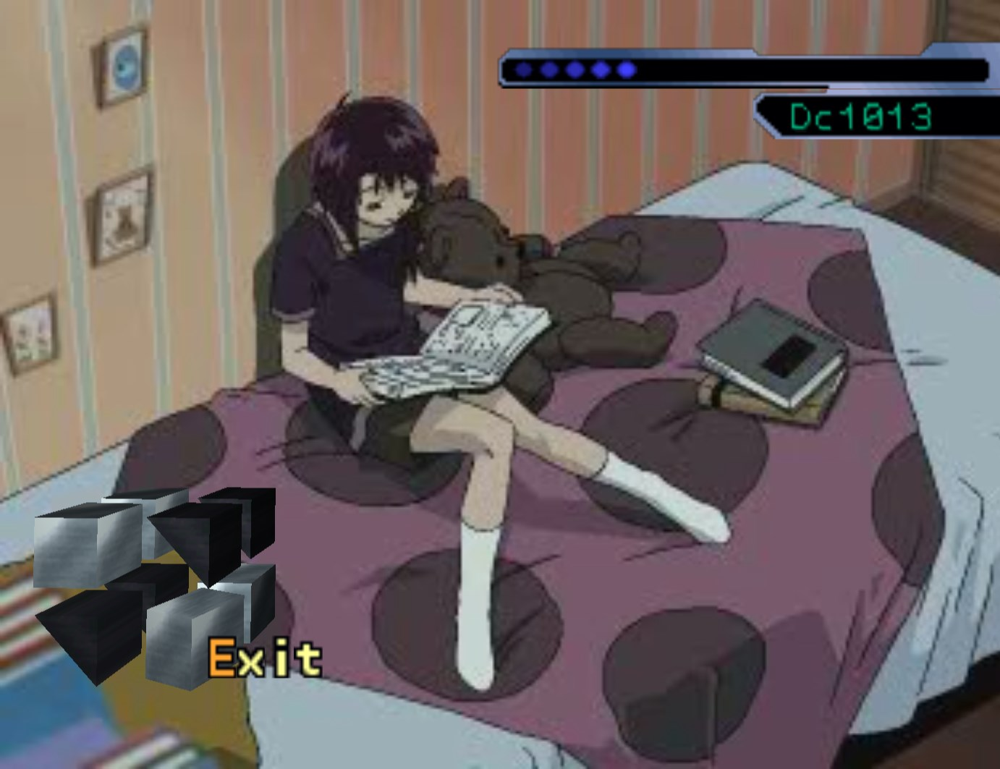
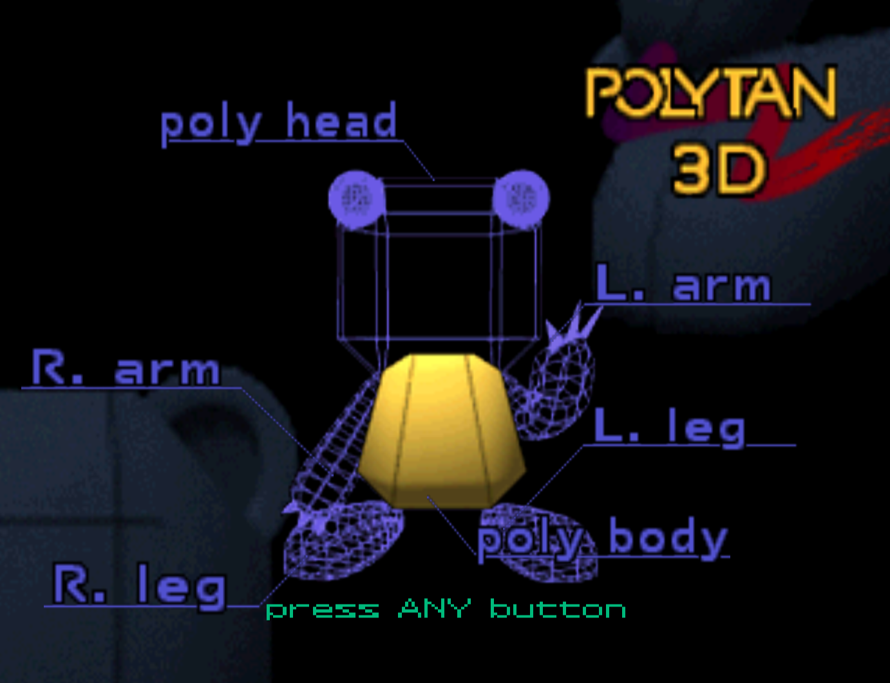
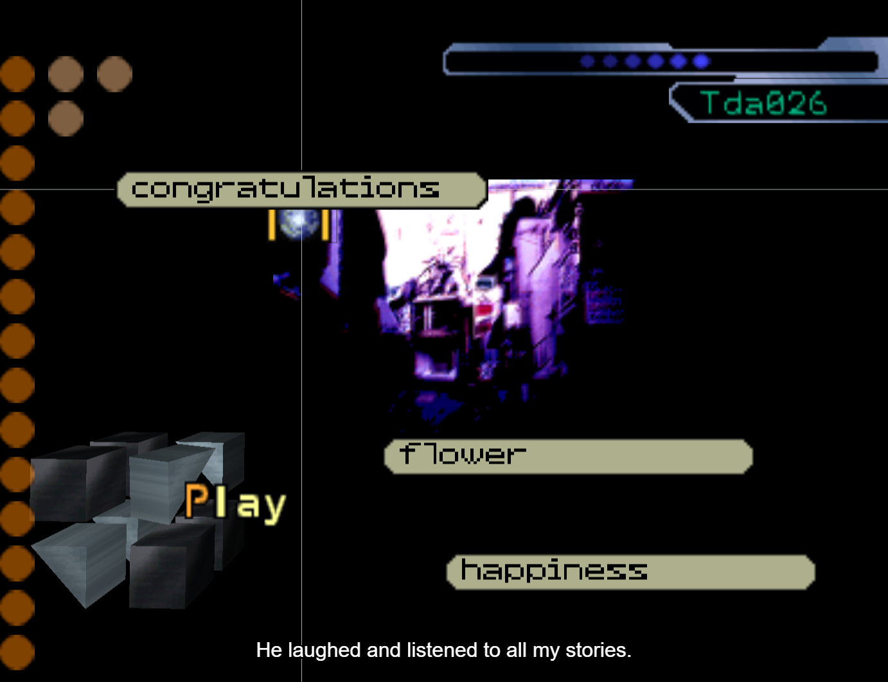

## lainTSX

A browser-based implementation of the Serial Experiments Lain PSX game using `react-three-fiber` with the aim to provide multi-language support and make it more accessible.

## History

The original PSX game was released in Japan, back in 1998. The game never got a proper english adaptation, which resulted in all non-Japanese speaking players either having to play through the game while simultaneously reading through the translation, or simply not playing the game at all and only reading it.

The goal of this project is to provide a better experience for those willing to play the game, and the way to do so is by implementing a subtitle system, which has the capability to support multiple languages.

## Building locally

Building locally is currently not possible. This is because the repository lacks static assets ripped from the game due to it being copyrighted content. The plan is to write an extraction script (currently located inside `scripts/extract`), where the user who owns the game provides the disc binaries themselves, and the script automates the static file extraction. This script is still WIP.

## Code strutcure

- **src/**

  - **/\_\_tests\_\_/** - Jest tests.
  - **/components/** - TSX components used in the actual 3D environment (sprites, meshes, etc.).
  - **/dom-components/** - TSX components used in the website itself (index page, guide, notes, etc.).
  - **/core/** - State management. Contextual (scene/state influenced) processors, mutation handler, event templates.
  - **/helpers/** - Helper functions used to boostrap functionalities (node finding algorithm, name selection handlers, etc.).
  - **/hooks/** - Custom hooks for React.
  - **/resources/** - Mostly reverse-engineered JSON data the game uses for a variety of tasks (node positions, font texture atlas definitions, etc.).
  - **/scenes/** - TSX components containing scene definitions.
  - **/static/** - Static files (sprites, css, sfx, media, fonts).
  - **/types/** - Type definitions.
  - **/utils/** - Utility functions.
  - **store.ts** - Zustand store used for managing global state.

- **scripts/**

  - **/extract/** - WIP extraction script to automate the local building process of the game.

## TODO

- **Finish writing the extraction script**
- **Improve/complete the translation**

## Screenshots

  
  
  
  
  
  
  
  

## Reporting bugs and contributing

If you have any ideas/suggestions/found an issue or want to help us with the translation or anything else, please submit an issue or join our [Discord server](https://discord.com/invite/W22Ga2R).

## Tools used during development

- [`jPSXdec`](https://github.com/m35/jpsxdec) - PlayStation 1 audio/video converter.
- [`three.js`](https://github.com/mrdoob/three.js/) - JavaScript 3D renderer.
- [`react-three-fiber`](https://github.com/pmndrs/react-three-fiber) - three.js wrapper for React.
- [`zustand`](https://github.com/pmndrs/zustand) - State management library for React.
- [`react-spring`](https://github.com/pmndrs/react-spring) - Animation library.
- [`drei`](https://github.com/pmndrs/drei) - Utilities for react-three-fiber.
- [`three-plain-animator`](https://github.com/MaciejWWojcik/three-plain-animator) - Sprite animation library.
